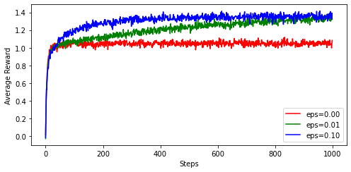
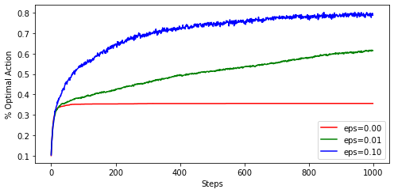

# k-armed Bandit Problem
Implementation of the k-armed bandit problem as described in Chapter 2 of "Reinforcement Learning" by Sutton and Barto.
[Here is a free online version of the book](https://www.andrew.cmu.edu/course/10-703/textbook/BartoSutton.pdf#page=47) (Or just google, in case link is down)
## Usage
Simply use [CMake](https://cmake.org/) to build and run the project.
The parameters of the problem can be set in main.cpp

After running the program, two output files are produced:
* meanRewardLog_eps_xxx.txt: This contains the reward per timestep, average over the entire ensemble of runs. Corresponds to the top in Figure 2.2 of Sutton and Barto 
* meanOptimalActionLog_eps_xxx.txt: This contains the percentage of times, the optimal action was taken at each specific timestep. Corresponds to the bottom in Figure 2.2 of Sutton and Barto 

As you can see, they are very close to Figure 2.2 from the book.

Here are some example outputs of the two respective files:

## Parameters
* **kArms**: number of arms/levers of bandit
* **mean**:  Each arm/lever generates a reward from a normal distribution. The means of these distributions are themselves generated from a (meta) normal distribution, which has this mean.
* **variance**: The variance of all distributions. Note that both the distributions of each individual arm, as well as the meta distribution for the mean values have the same variance.
* **epsilon**: Probability of choosing a random action instead of current best action
* **nRuns**:   Number of runs in the ensemble. E.g. nRuns =10 means that the k-armed bandit is initialized and run a total of 10 times.
* **nStepsPerRun**: Number of timestapes each instance of the ensemble runs.
## Implementation Notes
### Exploration method
The algorithm uses $\epsilon$-greedy action selection, meaning that in $\epsilon$ % of timesteps a random action is taken. In all other timesteps,
action with the currently highest estimated reward is chosen.
### Estimation of action values/rewards
The estimation of action values/rewards is done as described in section 2.4 of the book, i.e. simply averaging over all previously encounterd rewards for reach action. The initial reward estimates are all zero.
## Visualize Data
The python script pltBandit.py can be used to plot the results.